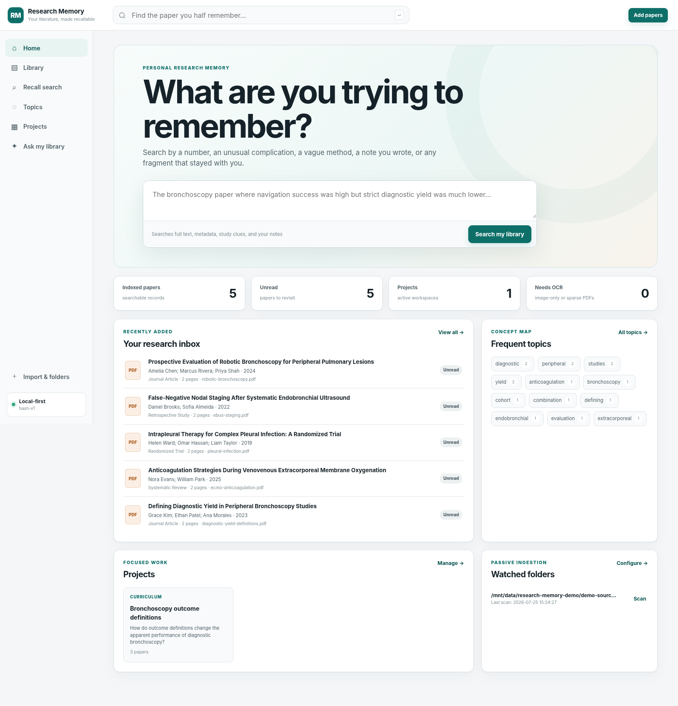
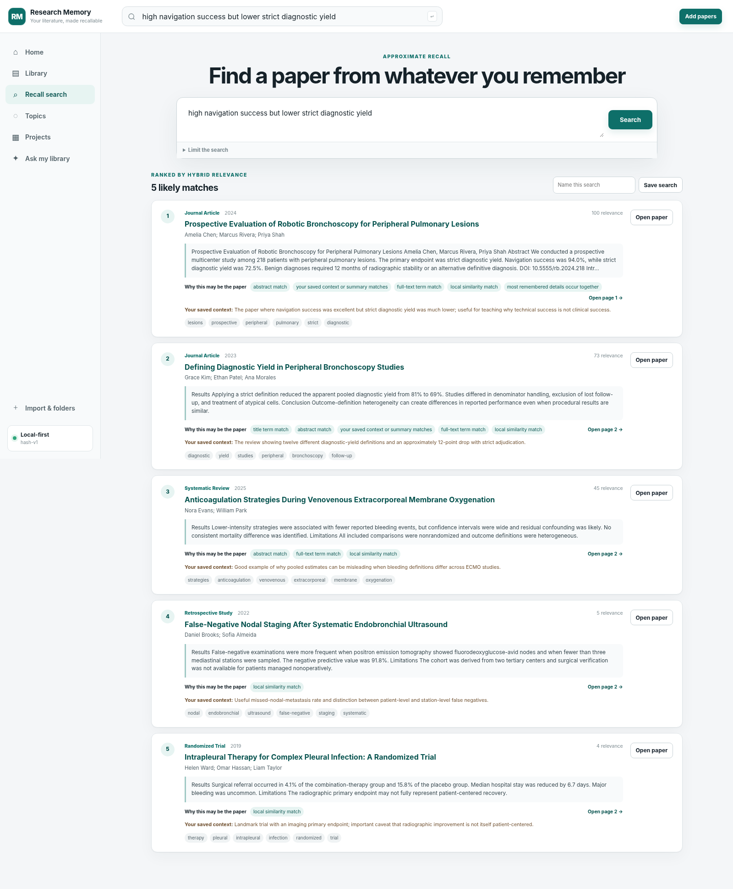

# Research Memory

A local-first application that turns a personal collection of research PDFs into a searchable, source-grounded research memory.

The first release is deliberately centered on one job: **find a half-remembered paper using whatever fragment you still remember, then return to the exact supporting page.**





## What is already implemented

- Multi-file PDF upload and recursive folder ingestion
- Optional managed copies or indexing files in their existing locations
- Exact duplicate detection by SHA-256
- Probable alternate-version detection by DOI or normalized title
- PDF metadata, DOI, PMID, abstract, year, author, and article-type recovery
- Optional Crossref metadata enrichment
- Page-level text extraction and searchable passage chunking
- SQLite FTS5 full-text retrieval
- Offline local-similarity retrieval with an optional sentence-transformer backend
- Search result explanations such as title, note, saved-context, full-text, and similarity matches
- Embedded PDF reading at the matching page
- Editable bibliographic metadata, reading status, importance, “why I saved this,” summaries, and notes
- Basic machine-extracted study clues with page provenance and confidence labels
- Automatically derived topic pages and publication timelines
- Project workspaces with screening-style statuses and exclusion reasons
- Source-grounded library Q&A with an extractive mode that works without an API key
- Optional synthesis through an OpenAI-compatible endpoint
- Project evidence-table export to CSV and Markdown
- Citation export to RIS and BibTeX
- One-click rescanning of registered folders
- Local JSON search API for future browser extensions and desktop clients

## Product boundary

This repository is a **functional v0.1 MVP**, not the entire mature product described in the product vision. It is suitable for validating ingestion, retrieval, personal-context capture, evidence organization, and source provenance. It is not yet a substitute for a validated systematic-review platform or a production citation manager.

## Quick start

Research Memory requires Python 3.11 or newer.

```bash
git clone <your-repository-url>
cd research-memory
python3 -m venv .venv
source .venv/bin/activate       # Windows: .venv\Scripts\activate
pip install -e .
research-memory
```

The application opens at:

```text
http://127.0.0.1:8765
```

By default, its database, managed PDF copies, and indexes are stored under:

```text
~/.research-memory/
```

Use a different private data directory when testing:

```bash
research-memory --data-dir ./research_memory_data
```

### macOS/Linux launcher

```bash
./scripts/start.sh
```

### Windows PowerShell launcher

```powershell
.\scripts\start.ps1
```

## Recommended first use

1. Start the app and open **Import & folders**.
2. Enter the path to a folder containing PDFs.
3. Leave **Include subfolders** and **Remember this folder** selected.
4. Leave **Copy into managed library** unselected when you want to preserve the existing folder structure.
5. Run searches using details you remember rather than exact citation information.
6. Open useful results and fill in **Why I saved this**. That personal layer becomes searchable immediately.
7. Create projects for manuscripts, reviews, lectures, guidelines, or curricula.

## Retrieval modes

### Offline baseline

The default `hash` backend combines:

- SQLite full-text search
- Hashed word and bigram similarity vectors
- Metadata matching
- Personal note and saved-context matching
- Importance weighting

It is private, deterministic, fast, and requires no model download. It improves approximate recall but is not a neural language model.

### Stronger semantic retrieval

Install the optional dependency:

```bash
pip install -e ".[semantic]"
```

Then set:

```bash
export RESEARCH_MEMORY_EMBEDDING_BACKEND=sentence-transformers
export RESEARCH_MEMORY_EMBEDDING_MODEL=sentence-transformers/all-MiniLM-L6-v2
research-memory
```

The selected model must be locally available or downloadable on first use. Existing documents need to be reingested or reindexed after changing embedding backends; an in-place reindex command is planned for the next release.

## Optional source-grounded synthesis

The **Ask my library** page always retrieves inspectable passages. Without a language model, it returns a conservative extractive response with source labels.

To enable synthesis through an OpenAI-compatible chat-completions endpoint:

```bash
export RESEARCH_MEMORY_LLM_BASE_URL=https://your-endpoint.example/v1
export RESEARCH_MEMORY_LLM_API_KEY=your-key
export RESEARCH_MEMORY_LLM_MODEL=your-model-name
research-memory
```

The application sends only the retrieved passages used for that question, not the complete library. Provider data handling still depends on the endpoint you configure.

## Optional Crossref enrichment

Local metadata extraction is always attempted first. Crossref lookup can improve title, author, journal, and year fields when a DOI is detected.

```bash
export RESEARCH_MEMORY_ENABLE_CROSSREF=true
export RESEARCH_MEMORY_CROSSREF_MAILTO=you@example.com
```

The application remains usable when offline or when metadata enrichment fails.

## Data model

Research Memory distinguishes an **article** from its **files**:

- `documents` stores the intellectual work and personal context.
- `document_files` stores one or more publisher, accepted-manuscript, or duplicate file versions.
- `document_pages` preserves extracted text by source page.
- `document_chunks` stores searchable passages and local vectors.
- `document_chunks_fts` is the SQLite full-text index.
- `notes` stores private page-linked notes.
- `projects` and `project_documents` create focused evidence workspaces.

This separation prevents a preprint and final publication from automatically becoming two unrelated library entries.

## Source-provenance rules

The MVP follows several non-negotiable behaviors:

- Search passages retain document and page identifiers.
- Study-card fields display page references and extraction confidence.
- Q&A evidence is shown beside the answer.
- A field can remain absent when extraction is uncertain.
- Machine-extracted study clues are explicitly labeled as unverified.
- Original files are never deleted when a note or project membership is removed.

## Development

Install development dependencies:

```bash
pip install -e ".[dev]"
```

Run tests:

```bash
pytest
```

Run the development server with reload:

```bash
research-memory --reload --no-browser
```

Health check:

```bash
curl http://127.0.0.1:8765/health
```

Search API example:

```bash
curl --get http://127.0.0.1:8765/api/search \
  --data-urlencode 'q=high navigation success but lower diagnostic yield'
```

## Current limitations

- Scanned image-only PDFs are detected but OCR is not yet included.
- Metadata extraction uses heuristics unless a DOI can be enriched.
- The default local-similarity backend is lexical rather than genuinely semantic.
- Changing embedding backends currently requires reingestion.
- Watched folders are rescanned manually; there is not yet a persistent filesystem daemon.
- Table and figure content is indexed only when it appears in extractable PDF text.
- Study-card extraction is intentionally conservative and does not yet perform validated PICO or risk-of-bias extraction.
- There is no Zotero synchronization, browser extension, citation-style engine, cloud sync, multiuser collaboration, or mobile application yet.
- The optional language-model adapter has not been certified for protected health information or regulated workflows.

## Next development sequence

The recommended order is:

1. OCR and ingestion reliability
2. Reindexing and background jobs
3. Zotero import/synchronization and browser capture
4. Domain-specific biomedical extraction with human verification
5. Figure and table indexing
6. Citation-family and overlapping-cohort detection
7. Topic synthesis, disagreement mapping, and evidence timelines
8. Desktop packaging with Tauri
9. Encrypted synchronization and collaboration
10. Prospective retrieval and extraction validation against expert-built reference libraries

See [`docs/PRODUCT_REQUIREMENTS.md`](docs/PRODUCT_REQUIREMENTS.md) and [`docs/TECHNICAL_ARCHITECTURE.md`](docs/TECHNICAL_ARCHITECTURE.md) for the detailed continuation plan.

## Privacy and intended use

The application binds to `127.0.0.1` by default and stores data locally. It is intended for legally obtained research literature. It should not be used to store patient-identifiable clinical documents in its current form.

## License

MIT
