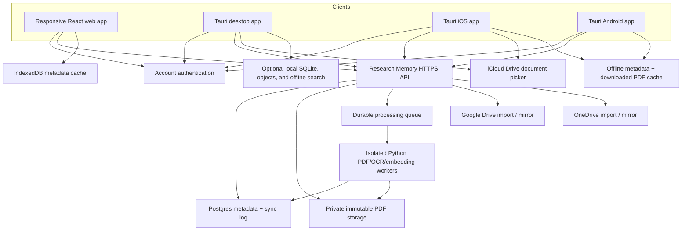

# Cross-Platform Library and Cloud Sync Architecture

Status: foundation implemented; provider connectors and cloud workers remain

Date: 2026-07-26

Scope: web, iOS, Android, account sync, cloud-drive import, and cloud-drive backup

The implemented first slice is documented in
[`CLOUD_DEVELOPMENT.md`](CLOUD_DEVELOPMENT.md). It includes account isolation,
responsive web/mobile-web UI, resumable PDF storage, signed reading, and synced
annotations while leaving the existing local-only desktop mode intact.

## Product decision

Research Memory should support two explicit library modes:

1. **Local-only** — the existing desktop behavior. No account is required, PDFs and indexes
   remain on the device, and encrypted portable backups remain available.
2. **Synced library** — the user signs in and opts into uploading their library so articles,
   projects, notes, annotations, processing status, and PDFs are available on their devices.

For a synced library, Research Memory's account service should be the source of truth.
Google Drive, OneDrive, and iCloud Drive are import and backup/mirror destinations, not the
live application database.

This distinction is important:

- **Sync** keeps application records consistent across devices.
- **Storage** makes immutable PDF bytes available to those devices.
- **Backup/mirroring** gives the user an independent copy in a location they control.

Using a third-party drive as the live sync engine would require Research Memory to encode
mutable database state into files, continuously reconcile provider-specific change feeds,
handle users editing or deleting those files, and resolve conflicts between multiple
devices. It would also fail to offer one consistent implementation for iCloud Drive on web
and Android. A canonical account service avoids those problems while still letting users
keep independent drive copies.

## Recommended user experience

### First sign-in

1. The user chooses **Keep this Mac local-only** or **Sync my library**.
2. Synced-library users sign in with email, Apple, Google, or Microsoft.
3. The app explains that synced PDFs and extracted content are uploaded and processed in
   Research Memory's cloud environment.
4. Existing local libraries are counted, hashed, and uploaded resumably.
5. The local database remains intact until server counts and PDF hashes have been verified.
6. The user may connect a drive for imports and independent backup copies.

Cloud sync must be opt-in. Enabling it changes the current privacy promise and must never be
hidden behind a routine sign-in screen.

### Add a paper

Every client offers:

- upload or system file picker;
- Google Drive;
- OneDrive;
- iCloud Drive where the operating system exposes it;
- existing desktop folder and Zotero import.

The resulting workflow is the same regardless of source:

```text
select source
  -> create resumable import
  -> copy PDF into account-owned immutable storage
  -> calculate and verify SHA-256
  -> create or reconcile the article and asset
  -> process text/OCR/metadata/search indexes
  -> optionally mirror original PDF to the user's chosen drive
  -> publish one sync change that all devices can receive
```

An imported provider file is copied into the synced library. It is not merely linked by a
short-lived provider URL. This keeps the article available if the connection is revoked,
the source file moves, or a temporary download URL expires.

### Connect a backup drive

The settings flow treats import access and backup access as separate permissions. A user
may connect either or both.

The recommended backup format has three layers:

1. Original PDF copies in a visible `Research Memory/PDFs` folder.
2. A small encrypted metadata snapshot containing articles, projects, notes, annotations,
   checksums, and a manifest.
3. An optional periodic full encrypted portable backup using the existing `.rmbak` design.

The app reports `up to date`, `pending`, `permission expired`, `quota exceeded`, or
`missing from mirror` for every backup connection. A failed mirror never removes the
canonical synced copy.

## Provider support matrix

| Capability | Google Drive | OneDrive | iCloud Drive |
|---|---|---|---|
| Web user-selected import | Google Picker + Drive API | OneDrive File Picker + Graph | Standard browser upload only |
| iOS/iPadOS user-selected import | Native document picker or Google Picker | Native document picker or OneDrive picker | Native document picker |
| Android user-selected import | Google Picker / system picker | OneDrive / system picker | Not generally available |
| Background PDF mirror | Yes, with user OAuth consent | Yes, preferably to the app folder | Not as a general cross-platform drive API |
| User-visible app folder | Yes | Yes (`Apps/Research Memory`) | Yes on Apple platforms |
| Persistent server-side access | OAuth refresh token | OAuth refresh token | Do not promise for arbitrary iCloud Drive files |

Implementation notes:

- Google imports should combine
  [Google Picker](https://developers.google.com/workspace/drive/api/guides/picker)
  with the least-privilege
  [`drive.file` scope](https://developers.google.com/workspace/drive/api/guides/api-specific-auth).
  That lets the user explicitly select files and lets the app create its own backup files
  without requesting access to the entire drive.
- OneDrive imports can use the
  [OneDrive File Picker](https://learn.microsoft.com/en-us/onedrive/developer/controls/file-pickers/?view=odsp-graph-online).
  Backup should use the least-privilege
  [OneDrive app folder](https://learn.microsoft.com/en-us/graph/onedrive-sharepoint-appfolder)
  where account type and current API support permit it.
- Apple exposes iCloud Drive and installed third-party storage providers through its
  [document browser and document picker](https://developer.apple.com/documentation/uikit/uidocumentbrowserviewcontroller).
  This is appropriate for user-initiated import/export on iOS and macOS. It is not an
  equivalent to Google Drive or Microsoft Graph for background access to arbitrary iCloud
  Drive files from a web or Android service.
- CloudKit is a possible future store for app-owned Apple data. It is not the same as a
  general iCloud Drive connector and should not be presented as one.

## Target architecture



### Reuse from the current repository

The following assets can be retained:

- React components, product vocabulary, and most responsive UI behavior;
- PDF.js reader and coordinate-based annotation rendering;
- Pydantic API contracts;
- immutable SHA-256 PDF identity and article-versus-asset model;
- extraction, OCR, metadata, chunking, and ranking logic;
- durable job stages and idempotent ingestion rules;
- encrypted portable backup format;
- the Tauri desktop shell and its native file handling.

The following pieces need a cloud implementation:

- SQLite repositories become account-scoped Postgres repositories;
- integer-only external identities gain stable UUIDs;
- local USearch becomes Postgres `pgvector` HNSW for cloud semantic search;
- SQLite FTS5 becomes Postgres full-text search;
- the private loopback token becomes an account access token on cloud requests;
- local object paths become private object keys and short-lived signed download URLs;
- in-process jobs become durable queue messages consumed by isolated workers;
- Tauri-only invocation becomes a runtime-independent client interface.

## Recommended application stack

### Client

- Continue using React, TypeScript, Vite, and PDF.js.
- Make the layout responsive and ship the same web bundle as a hosted web app.
- Continue with Tauri 2 for desktop and add its supported iOS and Android targets.
- Put all domain calls behind a `CoreClient` interface:
  - `LocalCoreClient` for the existing desktop sidecar;
  - `CloudCoreClient` for authenticated HTTPS;
  - a later `HybridCoreClient` for a synced desktop with offline fallback.
- Put file selection, secure credential storage, sharing, downloads, and deep links behind
  a separate `PlatformAdapter`.

The Python sidecar remains a desktop feature. It should not be made a dependency of the web
or mobile clients.

### Account, database, and object storage

For the initial hosted version, use:

- Supabase Auth for account sessions and OAuth identity linking;
- Supabase Postgres for metadata, revisions, and the change log;
- Supabase Storage for canonical private PDF objects;
- Postgres full-text search plus `pgvector` for cloud hybrid retrieval;
- a private durable queue for ingestion tasks;
- the existing FastAPI/Python code, adapted into a stateless API and worker service.

This is a starting architecture, not a requirement to put PDF/OCR work into short-lived edge
functions. PDF processing needs long-running, resource-controlled worker containers.

The web and mobile bundles may contain only a publishable client key. A service-role or
secret key must never be shipped to a client. Every exposed table and storage bucket needs
row-level policies, explicit grants, and account/library ownership checks. Provider refresh
tokens belong in a private schema encrypted with a managed key and are accessible only to
the connector service.

Current Supabase guidance requires RLS on exposed tables and warns that views bypass it
unless configured as security-invoker views. New projects also require deliberate table
exposure and grants rather than assuming a new `public` table is available through the Data
API. See the official
[RLS](https://supabase.com/docs/guides/database/postgres/row-level-security),
[Storage access control](https://supabase.com/docs/guides/storage/security/access-control),
and [hybrid search](https://supabase.com/docs/guides/ai/hybrid-search) guidance.

### Authentication

Start with:

- email address and password, with confirmed-email signup and password
  recovery;
- Sign in with Apple;
- Google;
- Microsoft.

Use Authorization Code + PKCE for public clients, universal/app links for callbacks, and
secure OS credential storage on native clients. Account linking needs an explicit
already-signed-in flow so matching email addresses alone cannot merge identities.

Apple's current App Review login rule should be considered before shipping the iOS build;
an app offering third-party social login for its primary account generally needs an
equivalent privacy-preserving login option. See
[App Review Guideline 4.8](https://developer.apple.com/app-store/review/guidelines/).

## Cloud data model

Do not replace the useful current separation between an intellectual article and immutable
PDF bytes. Extend it for ownership and synchronization.

### Identity strategy

- Cloud records use UUID primary keys generated client-side where offline creation matters.
- Existing local integer primary keys remain valid implementation details.
- Add a unique `public_id UUID` to local syncable records and maintain a local-to-cloud map.
- Every account-owned row carries `library_id`.
- Every mutable row carries `revision`, `created_at`, `updated_at`, and optional
  `deleted_at`.
- Every mutation carries a client-generated `operation_id` for idempotency.

### Core tables

| Table | Purpose |
|---|---|
| `libraries` | Personal library and sync/privacy settings |
| `library_members` | Owner now; future collaboration without a data migration |
| `devices` | Named sessions, last sync cursor, and revocation |
| `articles` | Bibliographic work and personal context |
| `article_assets` | Immutable PDF hash, size, role, version, and storage state |
| `article_pages` | Rebuildable page text and geometry |
| `article_chunks` | Rebuildable passages, search vectors, and provenance |
| `annotations` | UUID annotations with asset and page coordinates |
| `notes` | User-authored article notes |
| `projects` | Collections and project metadata |
| `project_articles` | Idempotent membership relation |
| `jobs` | User-visible import and processing state |
| `provider_connections` | Non-secret provider state and health |
| `provider_credentials` | Encrypted private OAuth credentials; never exposed |
| `provider_files` | Source/mirror IDs, versions, hashes, and last verification |
| `change_events` | Ordered per-library sync feed |
| `operation_receipts` | Idempotency and safe retry results |

The canonical object key should include the library boundary, for example:

```text
libraries/<library_uuid>/objects/<sha256[0:2]>/<sha256>.pdf
```

Do not perform physical deduplication across users. A global hash match can leak whether
another account owns a document and complicates ownership, retention, and deletion.

## Synchronization model

The server is authoritative, but clients maintain useful local state.

### Pull

```http
GET /api/v1/sync/changes?after=<opaque_cursor>&limit=500
```

The response contains ordered upserts/tombstones and a new opaque cursor. Cursors are scoped
to one library and cannot be guessed or reused across accounts.

### Push

```http
POST /api/v1/sync/operations
Idempotency-Key: <operation_uuid>
```

Each operation includes its target UUID, mutation type, client timestamp, and the last
server revision the client observed. Retrying the same operation returns the original
result.

### Conflict rules

- PDF assets are immutable and converge by `(library_id, sha256)`.
- Annotation IDs are created on the client; independent annotations merge naturally.
- Project membership uses idempotent add/remove operations.
- Reading status and importance may use last accepted server revision.
- Notes and summaries never silently discard concurrent text. Preserve the losing value as
  a conflict copy for user review.
- Deletes create tombstones retained long enough for all registered devices to observe.
- Realtime notifications may tell a client to pull, but the durable change feed is the
  source of truth. Correctness must not depend on receiving a websocket event.

CRDTs are not required for the first version because Research Memory does not yet have
simultaneous character-by-character collaboration. Revision checks, operation
idempotency, and visible text conflicts are simpler and auditable.

### Offline behavior

| Client | Initial offline capability |
|---|---|
| Desktop | Existing full local library and search; queue changes for later upload |
| iOS/Android | Cached library metadata, queued edits, and explicitly downloaded PDFs |
| Web | Cached shell and recent metadata; reconnect for PDF/search unless already cached |

Full semantic search over a 10,000-PDF library should remain cloud-backed on web/mobile in
the first release. Local semantic indexes on mobile and in browser storage can be evaluated
later. The reader's in-document text search can work for a downloaded PDF.

## Import and processing security

PDF parsing is an untrusted-code boundary. Cloud processing should improve the current
desktop isolation rather than duplicate its known risk.

Each worker should:

- run as an unprivileged, disposable container;
- receive access to one staged object and one job result location;
- have outbound network disabled during PDFium/Tesseract processing;
- enforce PDF byte, page, pixel, CPU, memory, and wall-clock limits;
- separate metadata-enrichment network calls from parsing;
- write only a narrow serialized extraction result;
- be safe to retry after interruption;
- verify the source hash before processing and before publishing results.

Uploads should be resumable and go directly to private object storage using a short-lived,
single-object authorization. The API finalizes an upload only after size, MIME structure,
and SHA-256 checks. The browser never receives a storage-administration credential.

## Drive connector design

### Provider credential lifecycle

1. Begin OAuth with a signed state value bound to the signed-in user and intended provider.
2. Complete Authorization Code + PKCE.
3. Encrypt refresh tokens before persistence.
4. Store requested and granted scopes, expiry, provider account ID, and health.
5. Refresh only in the connector service.
6. Let the user disconnect and revoke the provider.
7. Keep already imported canonical PDFs unless the user explicitly deletes them.

### Import records

Persist provider-native file ID, drive ID, revision/eTag, source filename, byte size, and
observed SHA-256. Do not rely on a path as identity; users can rename or move files.

### Mirror records

Every canonical asset may have zero or more mirror rows:

```text
asset UUID
provider connection UUID
provider file ID
last uploaded hash
last verified revision
status
last error code
last attempted/succeeded timestamps
```

Mirroring is one-way in the first release. Changes to a mirrored PDF do not mutate the
immutable canonical asset. If the user replaces it in their drive, show `mirror changed`
and offer to restore the canonical copy or import the replacement as a new asset version.

## Privacy and recovery

### Clear modes

| Mode | PDF location | Processing | Cross-device access |
|---|---|---|---|
| Local-only | User's device | Local | Portable backup/restore only |
| Synced | Device cache + Research Memory cloud | Isolated cloud workers, optionally local desktop | Account login |
| Future private sync | Client-encrypted cloud objects | Primarily local | Requires downloaded encrypted indexes/keys |

The first synced release is encrypted in transit and at rest, but it is not end-to-end
encrypted because server-side extraction and search require access to document content.
Marketing and onboarding must state this plainly. "Encrypted sync" must not be used to
imply that the service cannot decrypt the data.

A later end-to-end encrypted mode is possible, but it requires client-side processing,
key recovery, encrypted index distribution, and device-local search. It should be treated
as a distinct product project, not a configuration flag.

### Account deletion and retention

- Revoke active sessions and provider credentials.
- Place user records and objects into a short recoverable deletion window.
- Purge database rows, canonical objects, derived text, vectors, and logs after that window.
- A user's independent Google/OneDrive/iCloud backup is not silently deleted.
- Offer an encrypted portable export before deletion.

## Migration from the existing desktop library

1. Add stable `public_id` values without changing current integer primary keys.
2. Add local sync tables for operation receipts, cursors, and object upload state.
3. Let the user create or choose a synced library.
4. Snapshot the SQLite database using the existing backup mechanism.
5. Upload immutable PDFs resumably and verify every server hash.
6. Upload bibliographic and user-authored records with UUID relationships.
7. Rebuild cloud page/chunk/vector data from canonical PDFs rather than trusting local
   derived indexes.
8. Compare document, asset, annotation, note, and project counts.
9. Mark sync enabled only after verification.
10. Keep the local copy as an offline replica and rollback source.

Migration must be restartable. A crash or expired login cannot create duplicate articles,
annotations, or project memberships.

## Delivery phases

### Phase 0 — shared boundaries

- Extract `CoreClient` and `PlatformAdapter` interfaces.
- Make domain types use stable UUIDs at the transport boundary.
- Make the existing UI responsive at phone, tablet, and desktop widths.
- Add sync/privacy mode language without changing current local behavior.

Exit gate: the unchanged desktop feature set works through `LocalCoreClient`, and the React
bundle can load in a normal browser without importing a Tauri runtime.

### Phase 1 — account and web vertical slice

- Provision Auth, Postgres, private Storage, RLS, and migrations.
- Add the cloud FastAPI service and one worker.
- Implement login, direct PDF upload, library list, article detail, PDF reading, note and
  annotation sync, delete/restore, and job status.
- Migrate one existing desktop library with count/hash verification.

Exit gate: a PDF added on the Mac appears in the web library, opens in PDF.js, and an
annotation created in either client appears in the other without a refresh race or data
loss.

### Phase 2 — cloud retrieval and drive connections

- Move lexical and vector retrieval to account-scoped Postgres queries.
- Preserve current observed-signal match explanations and page coordinates.
- Add Google Picker import and Google Drive mirroring.
- Add OneDrive Picker import and OneDrive app-folder mirroring.
- Add connector health, retry, disconnect, and provider-token revocation.

Exit gate: provider imports and local uploads converge on the same hash identity, and a
non-cloud PDF is independently present and hash-verified in the selected backup drive.

### Phase 3 — mobile

- Add Tauri iOS and Android targets.
- Build phone/tablet navigation and a touch-appropriate PDF reader.
- Add native secure session storage, deep links, system document picker, share-sheet
  import, downloaded-PDF cache, and queued offline edits.
- Add native iCloud Drive import/export on Apple platforms.

Exit gate: a user can sign in, find a paper, download and read it, annotate it offline, and
observe the annotation on web/desktop after reconnecting.

### Phase 4 — resilience and release

- Encrypted metadata snapshots and periodic provider backups.
- Restore drills from canonical cloud storage and from independent drive backup.
- Multi-device conflict and tombstone testing.
- RLS, object-policy, provider-scope, and cross-account penetration tests.
- Quota, cost, abuse, copyright, privacy, account-deletion, App Store, and Play Store gates.

## Acceptance criteria

The synced product is not ready until all of the following are demonstrated:

- No authenticated user can enumerate another library's rows, object keys, signed URLs,
  jobs, hashes, or search results.
- A 250 MB upload can resume after network loss without duplicating an article.
- Replaying every write is idempotent.
- Concurrent note edits never silently erase text.
- Deleting on one device creates a recoverable tombstone observed by the others.
- Disconnecting Google or Microsoft stops future access while keeping explicitly imported
  canonical copies.
- A cloud-drive mirror failure is visible and retryable.
- Imported and mirrored files are verified by SHA-256.
- An existing local library can migrate, be interrupted, resume, and pass record/hash count
  checks.
- The cloud privacy disclosure clearly distinguishes at-rest encryption from end-to-end
  encryption.
- Provider and Research Memory account deletion behavior is tested and documented.

## Recommended first implementation slice

Build one narrow end-to-end path before implementing all providers:

> Sign in on the existing Mac app and a responsive web app, import one local PDF, upload and
> process it, see the same article on both devices, open the PDF, add an annotation, and
> verify the annotation syncs back.

That slice proves account isolation, object storage, processing, stable IDs, sync, and
transport abstraction. Google Drive and OneDrive then become additional import/mirror
adapters around a working canonical library rather than alternate foundations.
